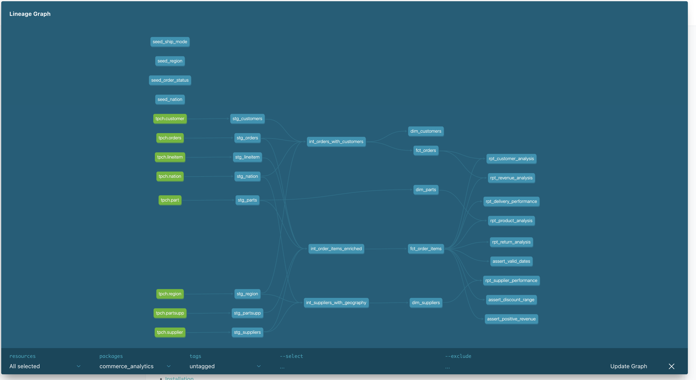

# commerce_analytics

End-to-end analytics engineering project built with dbt Core and Snowflake, processing 6 billion+ rows of B2B supply chain data.

---

## Project Overview

GlobalTrade Inc. is a B2B supply chain company operating across 5 global regions. This project builds a complete data warehouse covering revenue, customer, delivery, returns, supplier and product analytics.

**Scale:**
- 6 billion line items
- 1.5 billion orders
- 150 million customers
- 200 million products
- 10 million suppliers

---

## Architecture

    RAW DATA (Snowflake Sample Data - TPCH SF1000)
             ↓
    STAGING LAYER (8 models - views)
    → Clean and rename raw tables
             ↓
    INTERMEDIATE LAYER (3 models - ephemeral)
    → Reusable business logic and joins
             ↓
    MARTS/CORE (5 models - tables)
    → Dimensions and facts (star schema)
             ↓
    MARTS/REPORTING (6 models - tables)
    → Business KPIs and use cases

---

## Project Structure

    commerce_analytics/
    ├── models/
    │   ├── staging/
    │   │   ├── sources.yml
    │   │   ├── staging_schema.yml
    │   │   ├── stg_orders.sql
    │   │   ├── stg_customers.sql
    │   │   ├── stg_lineitem.sql
    │   │   ├── stg_parts.sql
    │   │   ├── stg_suppliers.sql
    │   │   ├── stg_partsupp.sql
    │   │   ├── stg_nation.sql
    │   │   └── stg_region.sql
    │   ├── intermediate/
    │   │   ├── int_orders_with_customers.sql
    │   │   ├── int_order_items_enriched.sql
    │   │   └── int_suppliers_with_geography.sql
    │   └── marts/
    │       ├── core/
    │       │   ├── core_schema.yml
    │       │   ├── dim_customers.sql
    │       │   ├── dim_parts.sql
    │       │   ├── dim_suppliers.sql
    │       │   ├── fct_orders.sql
    │       │   └── fct_order_items.sql
    │       └── reporting/
    │           ├── rpt_revenue_analysis.sql
    │           ├── rpt_customer_analysis.sql
    │           ├── rpt_delivery_performance.sql
    │           ├── rpt_return_analysis.sql
    │           ├── rpt_supplier_performance.sql
    │           └── rpt_product_analysis.sql
    ├── macros/
    │   ├── generate_schema_name.sql
    │   ├── get_balance_segment.sql
    │   └── get_part_type_component.sql
    ├── seeds/
    │   ├── seed_region.csv
    │   ├── seed_nation.csv
    │   ├── seed_order_status.csv
    │   └── seed_ship_mode.csv
    ├── tests/
    │   ├── assert_positive_revenue.sql
    │   ├── assert_valid_dates.sql
    │   └── assert_discount_range.sql
    ├── setup/
    │   └── snowflake_setup.sql
    └── dbt_project.yml

---

## Business Use Cases

| Report | Business Question | Rows |
|--------|------------------|------|
| rpt_revenue_analysis | Revenue by region, segment, date | 52M |
| rpt_customer_analysis | Customer lifetime value, segments | 100M |
| rpt_delivery_performance | On-time delivery rate by supplier | 5.9B |
| rpt_return_analysis | Return rate by product, supplier | 5.9B |
| rpt_supplier_performance | Supplier scorecard | 10M |
| rpt_product_analysis | Product profitability | 200M |

---

## Key KPIs

**Revenue:**
- Net Revenue = extended_price x (1 - discount)
- Gross Revenue = net_revenue x (1 + tax)
- Profit Margin = net_revenue - supply_cost
- Average Order Value = revenue / order count

**Operations:**
- On-Time Delivery Rate
- Average Days Late
- Return Rate
- Revenue Lost to Returns

**Customer:**
- Customer Lifetime Value
- Customer Tenure Days
- Customer Value Segment (Platinum/Gold/Silver/Bronze)

---

## Data Quality

84 tests total, all passing:
- 48 staging tests
- 36 marts core tests
- 3 custom singular tests

Test types:
- unique - no duplicate primary keys
- not_null - no missing critical values
- accepted_values - valid status codes
- relationships - referential integrity
- Custom: positive revenue, valid dates, discount range

---

## Tech Stack

| Tool | Purpose |
|------|---------|
| dbt Core 1.8 | Data transformation |
| Snowflake | Cloud data warehouse |
| GitHub Actions | CI/CD pipeline |
| Python 3.11 | Environment |

---

## How to Run

1. Clone the repo

        git clone https://github.com/vaibs21787/commerce_analytics.git
        cd commerce_analytics

2. Set up environment

        conda create -n dbt-env python=3.11 pip -y
        conda activate dbt-env
        pip install -r requirements.txt

3. Configure Snowflake connection

        Edit ~/.dbt/profiles.yml with your credentials
        Run setup/snowflake_setup.sql as ACCOUNTADMIN first

4. Run the project

        dbt seed          - Load reference data
        dbt run           - Build all models
        dbt test          - Run all 84 tests
        dbt docs generate - Generate documentation
        dbt docs serve    - View lineage graph

---

## Snowflake Setup

Run setup/snowflake_setup.sql as ACCOUNTADMIN to create:
- Role: dbt_role
- Warehouse: dbt_wh
- Database: commerce_analytics
- Schemas: raw, staging, intermediate, marts, reporting

---

## Author

Vaibhavi Shah
Analytics Engineer
GitHub: https://github.com/vaibs21787